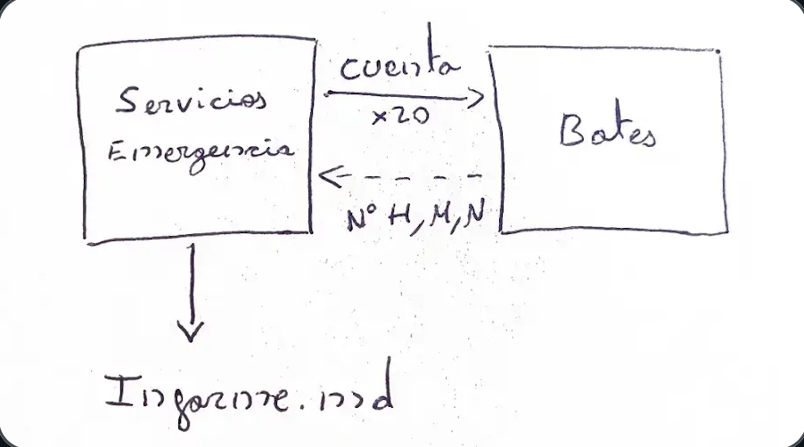
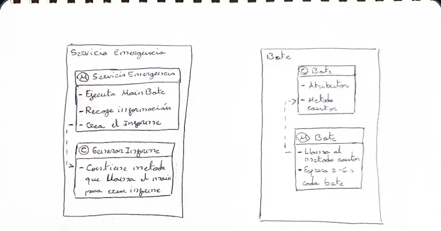

# Arquitectura técnica

Esta sección describe la arquitectura técnica y los componentes del sistema. Se omite contexto narrativo para centrarse en la solución.

## Patrón y flujo

- Patrón: maestro–trabajador (orquestador + procesos trabajadores).
- Flujo: `ServicioEmergencia` arranca N instancias de `MainBote` → cada `MainBote` simula conteo y escribe JSON por stdout → `ServicioEmergencia` lee stdout, parsea y agrega resultados → `GeneradorInforme` persiste `Informe.md`.

## Componentes

- `ServicioEmergencia`: arranque/gestión de procesos, lectura de stdout, parseo y agregación de resultados. Manejo de errores y coordinación con `GeneradorInforme`.
- `MainBote`: proceso autónomo que calcula aleatoriamente personas/mujeres/varones/niños y emite JSON por stdout.
- `Bote`: POJO que modela los datos de un bote (personas, mujeres, varones, niños, id).
- `GeneradorInforme`: responsable de formatear y escribir `Informe.md` en Markdown; punto de extensión para otros formatos (ej. `generarHTML()` lanza UnsupportedOperationException cuando no implementado).

### Diagramas

`ServicioEmergencia` lee la salida de cada proceso, invoca el parser (`Bote.fromJson`) y agrega el resultado a la colección interna.

Cuando todos los procesos han finalizado, `ServicioEmergencia` invoca `GeneradorInforme.generarInforme(...)` para persistir el Markdown con el detalle y los totales.

### Puntos de extensión

- Parser: hoy es un parser simple (regex); puede sustituirse por una librería JSON para mayor robustez.
- Generación de formatos: `GeneradorInforme` es el punto natural para añadir soportes adicionales (HTML, PDF), manteniendo el orquestador sin cambios.

### Errores y tolerancia

El orquestador captura errores al iniciar procesos y errores de lectura; los procesos fallidos quedan registrados y no impiden que se genere el informe con los datos disponibles.

Este diseño separa responsabilidades claras (orquestación, simulación y generación de informe) y facilita el testing unitario y la sustitución de componentes.
